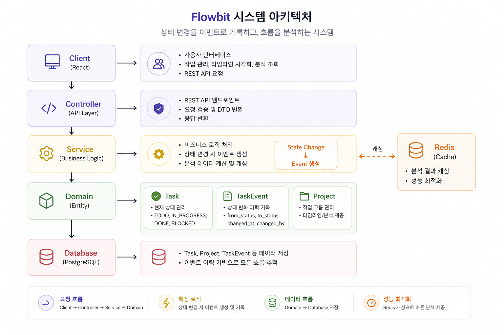
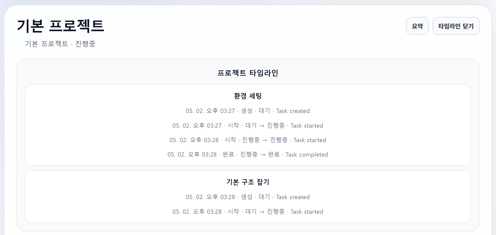

# 🐰 Flowbit

> 상태(State)를 저장하는 대신,  
> **이벤트(Event)를 기록하여 작업의 흐름(Flow)을 추적하는 시스템**

---

## Overview

Flowbit은 단순한 작업 관리 도구가 아니라,  
**작업의 상태가 어떻게 변화해왔는지를 중심으로 설계된 시스템**입니다.

기존의 Task 관리 시스템은 현재 상태만 보여주지만,  
Flowbit은 그 상태에 도달하기까지의 **과정(Flow)** 을 기록하고 분석합니다.

---

## Problem

기존 작업 관리 시스템의 한계:

- 현재 상태만 확인 가능
- 상태 변화 이력 추적이 어려움
- 작업 흐름 분석 불가
- 과거 시점 재구성 불가능

결과적으로 왜 이렇게 되었는지를 알기 어렵다

---

## Solution

Flowbit은 상태를 직접 저장하는 대신  
**이벤트를 통해 상태를 재구성하는 구조**를 사용합니다.

### 핵심 개념


State = Result
Event = Process


- Task → 현재 상태 (Result)
- TaskEvent → 상태 변화 이력 (Process)

이 구조를 통해:

- 시간 기반 흐름 추적
- 상태 변화 히스토리 유지
- 특정 시점 상태 재구성
- 이벤트 기반 분석

이 가능해집니다.

---

## Architecture



### Domain

- **Project**: 작업 단위 그룹
- **Task**: 현재 상태를 가지는 작업
- **TaskEvent**: 상태 변화 이력

### 특징

- 상태 변경 시 Event 생성
- Event 기반으로 상태 추론
- Soft Delete 구조 적용
- Redis 기반 분석 캐싱

---

##  Core Features

### 1. Project Management
- 프로젝트 생성 / 조회 / 수정 / 삭제
- 기본 프로젝트 자동 생성

### 2. Task Management
- 작업 생성 / 조회 / 수정 / 삭제
- 상태 변경 (Start / Complete / Block)

### 3. Event Sourcing 기반 상태 관리
- 모든 상태 변화는 TaskEvent로 기록
- 이벤트 기반 최신 상태 조회

### 4. Timeline
- 작업 단위 이벤트 흐름 조회
- 프로젝트 단위 통합 타임라인 제공



### 5. Analysis
- 상태별 작업 개수 (TODO, IN_PROGRESS, DONE, BLOCKED)
- 전체 이벤트 수
- 마지막 활동 시점

이벤트 기반 데이터 집계를 통해 프로젝트 상태를 분석

현재는 Spring Cache(`@Cacheable`) 기반으로 캐싱 구조를 적용했으며,  
향후 Redis를 활용한 분산 캐싱으로 확장할 예정

---

## 🔌 API Design

### Project

```http
POST /api/projects
GET /api/projects
GET /api/projects/{id}
PATCH /api/projects/{id}
PATCH /api/projects/{id}/delete
GET /api/projects/{id}/timeline
GET /api/projects/{id}/analysis
```

### Task

```http
POST /api/tasks
GET /api/tasks
GET /api/tasks/{id}

PATCH /api/tasks/{id}/start
PATCH /api/tasks/{id}/complete
PATCH /api/tasks/{id}/block
PATCH /api/tasks/{id}/delete

GET /api/tasks/{id}/events
GET /api/tasks/{id}/timeline
GET /api/tasks/{id}/latest-status
```

---

## Key Design Decisions

### 1. 상태 vs 이벤트 분리

상태만 저장하면 과거를 잃게 된다.  
이벤트를 기록하면 흐름을 얻는다.

Flowbit은 **결과**보다 **과정**을 선택했다.

### 2. Soft Delete 적용

데이터를 삭제하지 않고 상태로 관리

- TaskStatus.DELETED
- ProjectStatus.DELETED

이벤트 기반 시스템에서 이력 보존은 필수

### 3. 분석 데이터 캐싱 (Redis)

분석 API는 이벤트 전체를 계산해야 하기 때문에 비용이 크다.

`@Cacheable`을 활용해 성능 최적화

### 4. 기본 프로젝트 자동 생성

Task 생성 시 프로젝트가 없으면 DEFAULT 프로젝트 자동 할당

사용자 편의성과 시스템 안정성 확보

---

## Tech Stack

### Backend
- Java 21
- Spring Boot
- Spring Data JPA
- Redis

### Frontend
- React
- TypeScript
- Vite

### Infra
- PostgreSQL
- Docker

---

## Getting Started

```bash
docker-compose up -d
./gradlew bootRun
```

## Future Improvements
- User 도메인 추가 (권한/협업)
- 이벤트 타입 확장
- 알림 기능
- 시간 기반 리포트
- CI/CD 구축
- AWS 배포

---

Flowbit은 단순한 Task 관리 시스템이 아니라,

작업의 상태가 아닌 흐름을 관리하는 시스템이다.